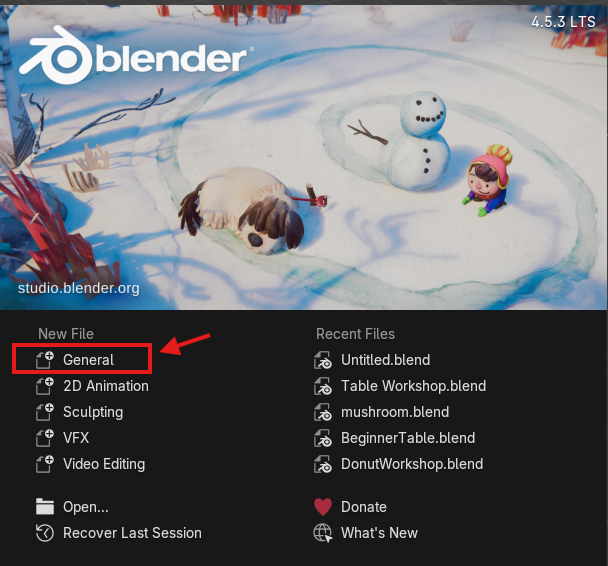
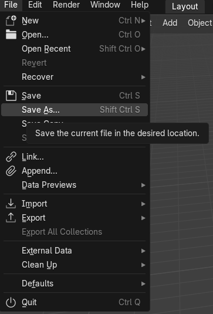
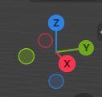

 

# Interface Intro Activity 

If you and your group have any questions or get stuck as you work through this in-class exercise, please ask the instructor for assistance.  Have fun!

## 1. Opening a new File in Blender:

1.Open Blender. A window should pop up that shows “New File” and “Recent Files”.
2.On the left under New File, select “General” to open a new file in a general workspace. A “General Workspace” means your Blender application will be set up so you have access to a large variety of different tools rather than specific tools for something such as Animation or VFX. 

## 2. Deleting and Adding Objects:

You will start with a cube in your scene. For the sake of the exercise, we are going to delete the cube and re-add it just so we can go over how to add and delete objects.  

1.Right click on the cube and select “Delete” at the bottom of the pop up window. You can also delete by left clicking the square and pressing Delete on your keyboard.
2.Go to “Add” At the top left of the viewport (the area in which your cube was) and click on “Mesh”. You will see there are different meshes you can add to your scene, some which are 2D and some are 3D. Feel free to add ones that look interesting and then practice deleting them from your scene. 
3.With nothing in your scene, select “Cube” (NOT the “Plane”). Now you have successfully deleted and readded an object back into your scene file. Keep the cube in your scene.

## 3. Saving in Blender:

It is important to save frequently when using Blender. If your application crashes, it is likely you will lose your unsaved work.

1. To save, move your cursor to “File” in the top left corner of the application. Select and drag down to “Save As”. Navigate through your files to a desired saving location, name your project and save. 
**Tip: To save your progress while working, you can use the shortcut “CTRL + S”**

## 4. Navigating the Viewport in Blender:

The window that your cube is in is known as the Viewport and can be tricky to learn how to navigate. Here are some keyboard shortcuts to memorize so you can move around your cube. Practice!

1.Pan= Shift + Middle Mouse Button + Drag Mouse
2.Zoom= Middle Mouse Scroll
3.Rotate= Middle Mouse Button + Drag Mouse

## 5. Trying the Gizmo

If you’ve never worked in a 3D space before, it may be kind of confusing to understand the dimensions. 3D workspaces are measured by 3 dimensions (3D!). Think of it like Height, Width, and Length: Z being height, and Y and X being the width or length. 

1. Navigate to the top right window of your viewport, you’ll see a red, blue, and green shape with a Z, Y and X in it called a **Gizmo**. It is a visual representation of the angle you are looking at your scene from. When you move your cursor over to it, it should light up and be enclosed in a circle.
2. You can **left-click** anywhere within and drag rotate the Gizmo to rotate your scene as well. Or you can select a dimension (Z for example) to snap to a profile shot of that dimension also known as an Orthographic View. To escape from the profile orthographic view simply rotate out of it. 

Now you can move around your object! This is important so you can see it properly from all angles during the modelling process. Feel free to review this page more if you want to get familiar 

Awesome work. You're ready to move on to the next activity!

[NEXT STEP: Cellphone Keychain Stand](2-keychain-stand.html){: .btn .btn-blue }
