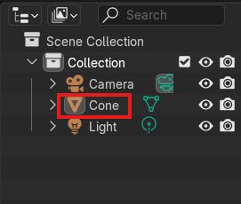
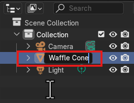
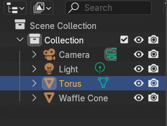
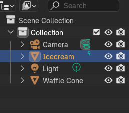

# Icecream Model Activity 

3D Modelling is tricky to learn, so let's create an extremely simple icecream cone to go over some basic Blender tools! If you want to take your icecream model to the next level, try the next exercise too!

## 1. Opening a new File in Blender

1. Open Blender. A window should pop up that shows *“New File”* and *“Recent Files”*. On the left under *"New File"*, select *“General”* to open a new file in a general workspace. A *"General Workspace"* means your Blender application will be set up so you have access to a large variety of different tools rather than specialized tools.
2.  If you already have Blender open, simply navigate to *"File"* in the corner, select *"New"*, and then *"General"*. 

## 2. Creating the cone

To begin, we are going to *"Add"* three different shapes to the viewport that we will combine together to make a basic ice cream cone. 

1. If you are beginning with a square in your scene, **right-click** on the square and select *"Delete"* at the bottom of the window. Now your viewport is emmpty.
2. Add a cone to your viewport by navigating to *"Add"* at the top left side of the screen. Mouse over *"Mesh"* and **left-click** *"Cone"* to add to your viewport.
3. Select *"Scale"* on the left tool bar and **left-click** the blue square at the top to drag upwards. Finish dragging by **left-clicking** when you achieve the ideal shape for your icecream cone.
    <button onclick="toggle('gif2')">Show/Hide Animation</button>
    

    
    
 
4. Select *"Rotate"* on the left tool bar and navigate to the properties tab on the right hand side. Under transform, there is a Rotation X, Y, and Z. Click on the 0 to the right of the Rotation Y and change the value to 180. This should flip your cone around so it's standing up.
5. Look to the right of the viewport in the top right window. There should be a list that says *"Camera" "Cone"* and *"Light"*. These are all of the things that are in your file right now. **Double click** on the word *"Cone"* and rename it to *"Waffle Cone"*. 
**Note: your viewport will have a camera and light in it by default and these are important to keep there for if you want to render an image of your ice cream cone after!*
    

## 3. Creating your icecream scoop

1. Add a sphere to your viewport by navigating to *"Add"* at the top left side of the screen. Mouse over *"Mesh"* and **left-click** *"UV Sphere"*.
2. Select *"Move"* on the left tool bar. Using the blue arrow pointing up, **left-click** on the arrow head and drag your icecream up until it's on the top of the icecream cone then **left-click** again to confirm.
3. If your icecream scoop is too large or small, select the *"Scale"* option on the left tool bar and click the white ring around the UV sphere to change the scale of the entire UV sphere. If you want to change just the height, use the blue square.
    <button onclick="toggle('gif3')">Show/Hide Animation</button>
    

    
    
 
4. Now, add a *"Torus"* into the viewport by going to *"Add", "Mesh"* and then *"Torus"*. Raise your torus up by selecting *"Move"* on the left tool bar and bring it up to the area where the icecream meets the cone. Alter the size by using *"Scale"* and using the white circle to click and drag the torus into a size that looks like the part of an icecream scoop that is overlapping the edge of the cone.
   
5. Look in the outliner window and note that there should be five objects in it: *"Camera, Waffle Cone, Light, Sphere,* and a *Torus"*.
   
## 4. Joining objects

Now, we want to turn the torus and the cone into the same shape so that we can edit them together. 

1. Begin by **left-clicking** on the *"UV Sphere"* and then **holding shift** to select the torus at the same time. 
2. Navigate to *"Object"* which is beside the *"Add"* button. **Left-click** on it and then choose *"join"*. Now your objects should be conjoined and your outliner will have conjoined the UV Sphere and Torus into the same object. Whichever object you click on first when joining them together is what the new object will be named. In this case, I selected the UV Sphere first so the conjoined object is named "UV Sphere".
    <button onclick="toggle('gif4')">Show/Hide Animation</button>
    

     
    
 
3. Go to your outliner window and **double click** the word *"UV Sphere"* to change it to *"Icecream"*
  
Wonderful, now you have created the basic icecream cone model! If you want to take it to the next level, try the next activity. 
