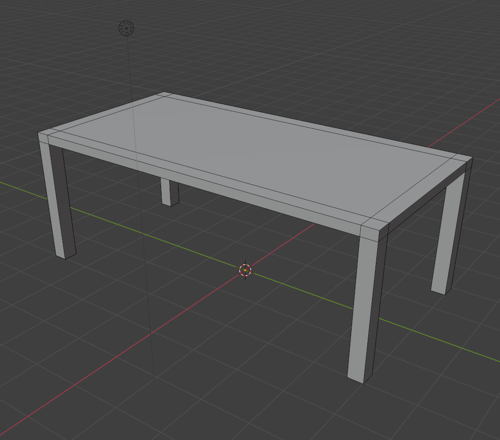
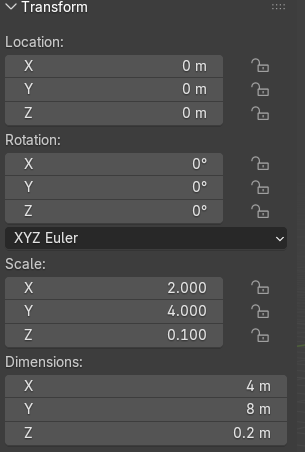
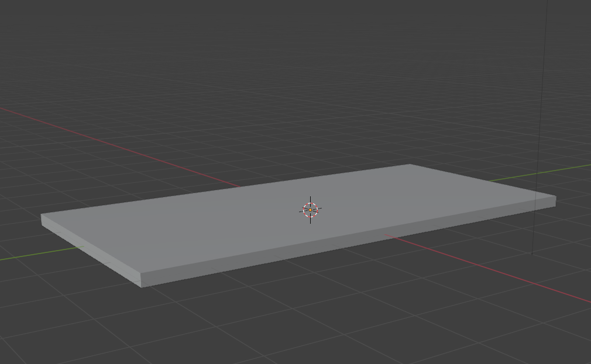
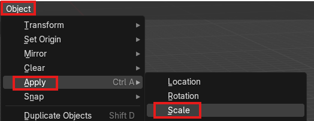
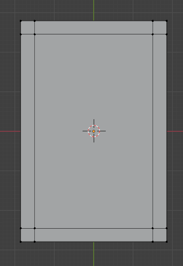
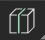
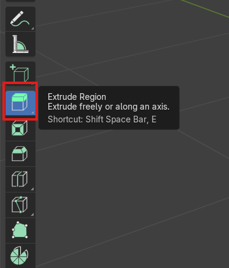

 

# Table Activity  

If you and your group have any questions or get stuck as you work through this in-class exercise, please ask the instructor for assistance.  Have fun!

## Opening a new file

1. First we will begin by going to file in the top left corner and clicking on "New" and then "General". You should have a cube in your scene to begin.

## Scaling the Cube into a Rectangle

To begin making a table we are going to turn the cube into a rectangle. 

1. First, begin by changing the dimensions of the cube to look like a flat rectangle (this will be the table top). In a 3D software you do this by *"scaling"* the dimensions. 

2. **Left Click** on the cube to select it and then pressing the **N key** to open the *"properties tab"*. This should pop up on the right hand side of the viewport beside the gizmo. The *"properties tab"* is a window which has information on your model such as the current rotation, scale dimensions, and location. You can also find it on the right hand side of your screen beside the view port and below the outliner. But for the sake of this exercise, familiarize yourself with the idea of pressing the **N key** to open the properties tab. 
   
3. In the properties tab under *"Dimensions"*, change the scale to be **X: 2m, Y: 4M, and Z: .1M**. You can also scale with the scale tool on the left hand tool bar using the “scale” option and dragging each square along the 3 coloured dimensions to change your shape by clicking on one of the coloured squares and dragging. You should end up with a flat rectangle shape.
    
4. Next we want to "apply" the scale which means we will turn the scale into the default scale for this object. Navigate to the top left of your viewport and select "Object", "Apply" and then "Scale". (Now Blender will understand your rectangle as an unedited rectangle rather than an edited cube and thus will make editing the rectangle easier.)
   
5. Save your file.
 

## Loop Cutting A Mesh in Edit Mode

Instead of adding extra shapes to create the legs of the table, we are going to edit the “Mesh” of the rectangle (think of this like the shell of the shape) by cutting the “Faces” of the shape it into smaller pieces and then “Extruding” shapes from the rectangle we just made. This is best practice for 3D models as it keeps things simple and thus easier to edit later on. To do this, you must turn your Object Interaction mode to “Edit Mode”. 
  
 
1. Change your *"Object Interaction Mode"* from *"Object Mode"* to *"Edit Mode"* at the top left corner beneath the *“Edit”* and *“Render”* tabs. **Left click** on *"Object Mode"* and a window will pop up. Select *"Edit Mode"*. You can also press **Tab** on your keyboard to switch between Object Mode and Edit Mode easier. In Edit Mode we begin to edit Points, Vertices, and Faces which is what makes up your object. You will also see on the left hand side of the screen that you have a lot more tools to use. These are used to edit the mesh of the object.
   
2. Bring your cursor over to the navigation **gizmo** in the top right corner and select the blue **-Z** option so that you are staring at a direct profile of the bottom half of the table top. 

4. Select the *“Loop Cut”*   box on the left hand tool bar. It should be a cube with a vertical line going up the centre. Make sure your rectangle is selected (it will be orange tinted if it is selected) by going to "Select" and then "All" at the top of the view port. 

5. Drag your cursor over to the centre line of the rectangle until an either horizontal or vertical yellow line appears. When it does, **click** and then **dragyour mouse outwards** vertically towards the edge of the table one way and then **left click** to apply. Repeat with the vertical dimension so each corner of the bottom of the rectangle has a small square and so there are 9 faces on the bottom in total when you count. See the example.

6. Save your file.

## Extruding Faces

Now that we have cut the mesh into smaller faces, we are going to Extrude the little squares we made on each corner of the bottom of the rectangle. We will pull them downward to create the table legs.

1. Hold the **middle mouse button** and drag to adjust the angle of the table so you can select all 4 squares and also drag downwards. 

2. Now we are going to change our editing mode to "Face Mode". Navigate to the top left corner beside the drop down menu that says "Edit Mode". To the right of it will be three boxes. You want to select the furthest right one which is named "Face Mode" because now we will be extruding faces from the bottom side of the model.
   
3. Turn on "Extrude Region" which is found on the tool bar on the left. **Hold shift** and select the four small squares on each corner of the table at the same time. Press the plus sign and drag them outward to extrude until you have your desired length of table legs.

4. Save your file.

## Exporting Your File

Now you have made a beginner table in Blender! If you would like to export your model, follow these steps.

1. Go to “File” at the top left of the window. Click and select *“Export”*. 

2. Find your preferred file destination and then rename if wanted. 

3. Choose an .STL file or an .obj file. Note: .stl files are perfectly fine for simple models that have no colour. 

