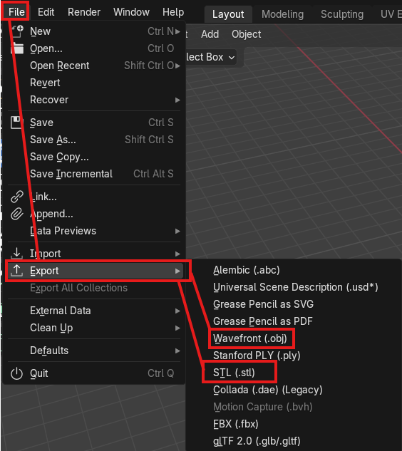
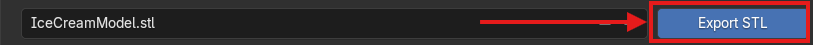

# Exporting Activity

Now that you have created a model, you may want to export it to use it outside of Blender. You may want to 3D print your model or put it into other softwares.

## File Types

There are many different types of 3D model file types but the most frequently used are *".stl"* or *".obj"* files. 

1. An *".stl"* file means a *"Standard Tesselation Language"* file which were created for 3D printing! If you do not want to retain colour or texture information in your model, an .stl file is perfect for exporting.
2. *"Wavefront .obj"* files are *"object files"* and were created for 3D models in animation. These files contain colour and texture information for transferring your 3D model into other CAD (Computer Aided Design) applications.

## How to Export

1. Select *"File"* at the top left of the viewport and select *"Export*"

2. In the pop-up window, select your file type of choice (either .stl or wavefront .obj in this case).

3. Select your save location in your files and then choose the blue button at the bottom of that window which says *"Export STL"* or *"Export Wavefront OBJ"* depending on which one you chose.

You are finished! Great work! If you want to try some more advanced modelling tools, click on for the next activity which explores "Edit Mode" in Blender. 

[NEXT STEP: Creaing a Table](6-table.html){: .btn .btn-blue }
